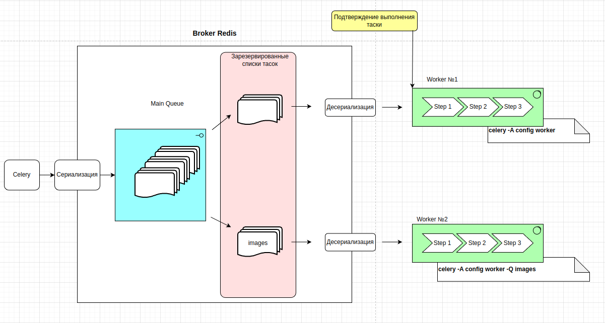
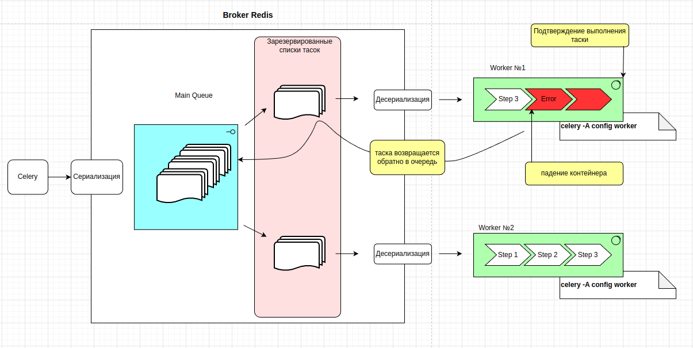

---
Подтверждение задач
---

`Celery` придерживается стратегии того что задачи не являются идемпотентными,
по этому его политика, одна задача должна быть выполнена только один раз, в
какой же момент происходит подтверждение того что задача взята в работу.

Давайте с начала посмотрим на весь процесс того как `Celery` выполняет задачи
через брокер сообщений, в качестве брокера возьмем `Redis`.

Стандартная схема работы `Celery`:



Когда сообщения(таски) поступаю в очередь, воркеры резервируют их на себя, и эти
сообщения будут выполняться в своих воркерах, однако после резервирования сообщения
не удаляются из очереди, а остаются в ней, помещаясь в специальный список 
зарезервированных тасок(сообщений) и не могут быть выбраны другими воркерами,
потому что у каждого воркера есть свой список зарезервированных тасок.

Существует неименованная очередь, которая используется по дефолту, в нее 
складываются все таски и от туда же выбираются воркерами для работы.

Так же можно создать именованную очередь, и назначить конкретный воркер на
выполнение тасок именно из этой очереди, и не от куда больше, задать
именованную очередь можно с помощью специального параметра 
`-Q <название очереди>` и соответствующей настройки самого `Celery` что 
будет описано ниже.

Когда воркер берет таску в работу он подтверждает ее выполнением, подтверждает то 
что берет ее в работу, если же таска по каким либо причинам не выполнится в этом
воркере то она будет иметь статус `FAILURE`.

Мы можем изменить поведение `Celery` изменить момент подтверждения взятия таски в 
работу, установив параметр `CELERY_ACKS_LATE`, воркер будет подтверждать выполнение 
таски только после ее полного завершения. Но существует вероятность того что такая
таска может быть взята в работу не один раз, в случае если воркер берет таску 
в работу и умирает в процессе выполнения таски, то эта таска будучи неподтвержденной,
вернется из зарезервированного списка обратно в очередь, и может быть взята либо
другим воркером, либо тем же воркером после рестарта.

Таким образом имея установленный параметр `CELERY_ACKS_LATE` таска может несколько
раз падать, и обратно возвращаться в очередь, но если в самой таске, или ее аргументах
существует ошибка которая не позволит таске выполниться никогда, то тогда существует
вероятность того что таска войдет в непрерывный цикл, меняя воркер за воркером, и не
будет подтверждена, что значит она будет бесконечно висеть в брокере.

Случай с включенным параметром `CELERY_ACKS_LATE` и падением контейнера:



Параметр: `CELERY_ACKS_LATE` 

Значения:
- `True` - Подтверждение задачи после ее выполнения
- `False` - Подтверждение задачи непосредственно перед ее выполнением  

По стандартному поведению `Celery`, подтверждение выполнения задачи происходит 
непосредственно перед тем, как она начинает выполняться в обработчике. Но мы можем
изменить это поведение данным параметром. Использование параметра `CELERY_ACKS_LATE`
изменит глобальное поведение `Celery`, задать подобное поведение для конкретной таски
можно следующим способом:

```python
@app.task(bind=True, acks_late=True)
def task():
    ...
```

---
Как создать именованную очередь в `Celery`
---

У каждой таски есть свое уникальное имя, которое можно задать 
при создании таски.

```python
@shared_task(name="Task type №1")
def task():
    ...
```

В настройках `Celery`, мы должны задать маршрутизацию, которая укажет
какие таски в какие очереди помещать

```python
CELERY_TASK_ROUTES = {
    "Task type №1": {"queue": "type_1_queue"}
}
```

Теперь все таски с именем `Task type №1` будут при обработке помещаться в
очередь "type_1_queue".

Для запуска таких тасок, при старте воркера, требуется явно указать что этот 
воркер будет брать таски из именованной очереди, сделать это можно с помощью 
параметра `-Q` к примеру вот так:

```
-A config worker --loglevel=info -Q type_1_queue
```

---
Celery создание приложения
---

Все начинается с создания Celery приложения, это приложение должно
быть доступно в других программах, так что оформить приложение на 
Celery требуется в специальный модуль, который обычно называют 
`tasks.py` если программа маленькая то этого достаточно, если
нет то оформляют в отдельный пакет.

Создадим файл tasks.py:

```python
from celery import Celery

# Название модуля и выбор брокера сообщения
# app = Celery('tasks', broker='pyamqp://guest@localhost//')
app = Celery('tasks', broker='redis://localhost:6379/0')

@app.task
def add(x, y):
    return x + y
```

Первый параметр это название текущего модуля.

При создании приложения вторым параметром мы указываем используемый
брокер сообщений, можно просто вынести эти настройки в файл 
`settings.py` и импортировать настройки 

    CELERY_BROKER_URL = 'redis://127.0.0.1:6379/0'

А можно указывать и напрямую при создании приложения

```python
    app = Celery(
                'django_celery', 
                broker_url='redis://127.0.0.1:6379/0'
                )
```

В этом примере мы создали одну задачу с названием `add` это 
функция, что оборачивается декоратором `@app.task` или `@shared_task`

---

Вызов задачи Celery
---

Когда мы создали задачу, что может выполняться в фоновом режиме, 
совместно с брокером сообщений Redis, теперь ее можно вызвать на
исполнение.

Для вызова нашей задачи используем метод `delay()` который доступен
теперь когда функция выполнения задачи привязана к Celery.

Запуск задачи через Celery

```python
from tasks import add
add.delay(4, 4)
```

Вызов в работу такой задачи возвращает экземпляр класса `AsyncResult`
через этот класс мы можем получить состояние задачи, ожидания
завершения задачи или получения ее возвращаемого значения (или, 
если задача не удалась, для получения исключения и трассировки).

---

Получение результатов
---

Существует 2 отдельные темы, это `Брокер Сообщений` и 
`Бэкэнд Результатов` 

```python
    app = Celery(
                'tasks', 
                backend='redis://localhost:6379/0', 
                broker='redis://localhost:6379/0'
    )
```

Если мы хотим отслеживать задачи или нужно возвращать результат 
работы, тогда Celery должен где-то хранить или отправлять состояния,
чтобы их можно было получить позже. Есть несколько встроенных
бэкэндов результатов на выбор:

- `SQLAlchemy` / `Django ORM`
- `Memcached`
- `RabbitMQ` 
- `Redis`

И так, запустили функцию, получаем результат:

```python
result = add.delay(4, 4)

print(result.ready())

    # Вывод
    # False
```

Метод `ready()` возвращает результат, выполнена работа или нет.

У каждой запущенной задачи есть ее уникальный `UUID` доступный по 
`id` атрибуту.
```python
result.id
d6b3aea2-fb9b-4ebc-8da4-848818db9114
```

Так как же узнать, провалилась ли задача? Это можно узнать,
посмотрев на состояние задач:

```python
res.state

# 'FAILURE'
```

```python
res.failed()
# True

res.successful()
# False
```

---
