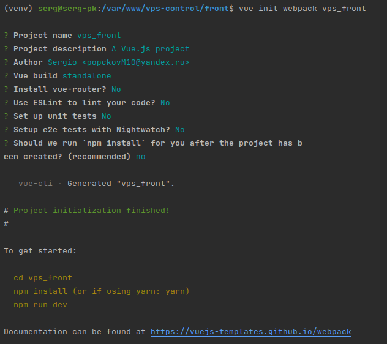

Vue.js  
---
---

Установка `Vue` через установщик `npm`

    npm install vue

---

Есть 2 способа создания проекта на `Vue`:

1) Для легковесных проектов, можно подключать `Vue` через ссылку в шаблоне `html`

```html
    <script src="https://cdn.jsdelivr.net/npm/vue@2/dist/vue.js"></script>
```


2) Для более серьезных проектов, установим `Vue` в свою систему. 
Установка `Vue` в `CLI` что бы иметь доступ к утилите `Vue` в терминале


    npm i -g @vue/cli-init

Создание проекта на `Vue`

     vue init webpack project_name

После этого проходим опрос для создания проекта



После этого будет сгенерирована директория с проектом, для установки всех 
зависимостей проекта перейдем в директорию и установим их с помощью `npm`:

    npm install

Далее можно будет запустить сервер для разработки

    npm run dev

При запуске `Vue` пойдет на порт `8080`

---
Проблема при запуске сервера
---


    Error from chokidar (/var/www/vue_test_project/src): Error: ENOSPC: System limit for number of file watchers reached, watch '/var/www/vue_test_project/src/App.vue'
    Error from chokidar (/var/www/vue_test_project/src): Error: ENOSPC: System limit for number of file watchers reached, watch '/var/www/vue_test_project/src/main.js'
    Error from chokidar (/var/www/vue_test_project/src/assets): Error: ENOSPC: System limit for number of file watchers reached, watch '/var/www/vue_test_project/src/assets/logo.png'
    Error from chokidar (/var/www/vue_test_project/src/components): Error: ENOSPC: System limit for number of file watchers reached, watch '/var/www/vue_test_project/src/components/HelloWorld.vue'
    Error from chokidar (/var/www/vue_test_project/static): Error: ENOSPC: System limit for number of file watchers reached, watch '/var/www/vue_test_project/static/.gitkeep'


echo fs.inotify.max_user_watches=524288 | sudo tee -a /etc/sysctl.conf && sudo sysctl -p


---
Установка дополнительных пакетов для разработки.
---

1) `pug` - препроцессор для `HTML`

```
    npm install pug --save-dev
```

2) `axios` - Для отправки `HTTP` запросов к `API`  сервере

```
    npm install axios vue-axios --save
```

3) `vuex` - Для хранения наших заметок в хранилище

```
    npm install vuex --save
```


---
Пример работы
---
Есть API, хотим обращаться к нему с помощью `axios` и получать данные с API.

Код `Vue` для получения данных с точки API
```
import Vue from 'vue'
import axios from 'axios'

const api_vps_url = 'http://localhost:8000/api/v1/vps'

new Vue({
  el: '#show-all',

  data() {
    return {
      info: null
    };
  },

  mounted() {
    axios
      .get(api_vps_url)
      .then(response => (this.info = response.data));
  }
  
});
```

`html` для вывода информации

```html
    <div id="show-all">

      <h1>Все записи</h1>

      <ul v-for="vps in info" class="currency">
        <li>pk: {{ vps.pk }}</li>
        <li>uid: {{ vps.uid }}</li>
        <li>cpu: {{ vps.cpu }}</li>
        <li>ram: {{ vps.ram }}</li>
        <li>hdd: {{ vps.hdd }}</li>
        <li>status: {{ vps.status }}</li>
      </ul>

    </div>
```


