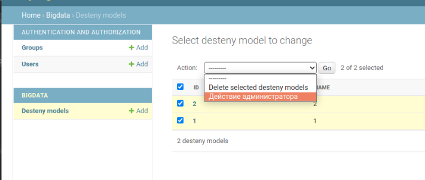

Действия администратора
---

Находясь на странице админки, и просматривая группу объектов некоторой 
модели, мы можем регистрировать «действия» - функции, которые вызываются
со списком объектов, выбранных на странице списка изменений.

**Функции действия**

Создать функцию действие можно как обычную функция и зарегистрировать ее
в модели в специальном атрибуте `actions`, описание для действия можно
присвоить в классовый атрибут этой функции `function_name.short_description`

```python
from django.contrib import admin
from myapp.models import Article

def actions_for_admin(modeladmin, request, queryset):
    print('Действие администратора, далее логика')

action_for_admin.short_description = 'Действие администратора'
    
class ArticleAdmin(admin.ModelAdmin):
    list_display = ['title', 'status']
    ordering = ['title']
    actions = [actions_for_admin]

admin.site.register(Article, ArticleAdmin)
```

Все действия администратора будут доступны в выпадающем списке, рядом с
перечислением всех объектов модели, как на рисунке.

По дефолтному поведению, действие администратора не сработает если 
не выбран хотя бы один из элементов модели.



---

Функция действие имеет 3 параметра :

1. `modeladmin` - какая модель какого приложения используется   
2. `request` - объект запроса `WSGIRequest`
3. `queryset` - кверисет из выбранных объектов

```
modeladmin =  bigdata.DestenyModelAdmin
request =  <WSGIRequest: POST '/admin/bigdata/destenymodel/'>
queryset =  <QuerySet [
                <DestenyModel: DestenyModel object (2)>, 
                <DestenyModel: DestenyModel object (1)>
            ]>
```

---
Действия как методы `ModelAdmin`
---

Действия можно регистрировать не как отдельную функцию, а как метод
класса.

Так же вместо присвоения описания атрибуту класса этой функции
действия, можно использовать специальные декораторы 
`@admin.action(description='')` эти декораторы сработают как для методов
класса так и для независимых функций действий

```python
from django.contrib import admin

class DestenyModelAdmin(admin.ModelAdmin):
    list_display = ('id', 'name',)
    actions = ['action_for_admin']

    @admin.action(description='Новое действие администратора')
    def action_for_admin(self, request, queryset):
        print('self = ', self)
        print('request = ', request)
        print('queryset = ', queryset)

admin.site.register(DestenyModel, DestenyModelAdmin)
```

---
URL в админке `ModelAdmin.get_urls()`
---

`get_urls` - Метод возвращает `URL` адреса которые будут использовать
для взаимодействия с этой зарегистрированной моделью.

Родительский метод `get_urls` 
```python
class ModelAdmin(BaseModelAdmin):
    
  def get_urls(self):
        from django.urls import path

        def wrap(view):
            def wrapper(*args, **kwargs):
                return self.admin_site.admin_view(view)(*args, **kwargs)
            wrapper.model_admin = self
            return update_wrapper(wrapper, view)

        info = self.model._meta.app_label, self.model._meta.model_name

        urlpatterns = [
            path('', wrap(self.changelist_view), name='%s_%s_changelist' % info),
            path('add/', wrap(self.add_view), name='%s_%s_add' % info),
            path('autocomplete/', wrap(self.autocomplete_view), name='%s_%s_autocomplete' % info),
            path('<path:object_id>/history/', wrap(self.history_view), name='%s_%s_history' % info),
            path('<path:object_id>/delete/', wrap(self.delete_view), name='%s_%s_delete' % info),
            path('<path:object_id>/change/', wrap(self.change_view), name='%s_%s_change' % info),
            # For backwards compatibility (was the change url before 1.9)
            path('<path:object_id>/', wrap(RedirectView.as_view(
                pattern_name='%s:%s_%s_change' % ((self.admin_site.name,) + info)
            ))),
        ]
        return urlpatterns
```

Используя этот метод мы можем расширять административную часть, добавляя
представления и `URL` для них, тут можно как зарегистрировать новое 
представление для административной части, так и для создания представления
которое не будет иметь отображения, а будет отрабатывать на кастомно 
созданную кнопку.

Для регистрации нового пути, наследуем `super().get_urls()` родительский
метод, и расширяем его дополнительным путем, регистрируем его так же как
и обычные пути в `settings`

Так же создаем представление `my_view` в административной части, которое
и регистрируем за указанным `URL`, определяем для него контекст и шаблон 
для внешнего вида.

```python
from .models import DestenyModel
from django.template.response import TemplateResponse
from django.urls import path

class DestenyModelAdmin(admin.ModelAdmin):
    list_display = ('id', 'name',)
    
    def get_urls(self):
        """Расширяем пути, добавляя виды для конкретно этой админки"""
        # получаем родительские URL
        urls = super().get_urls()

        # создаем пути для конкретно этой админки
        my_urls = [
            path('my_view/', self.my_view),
        ]

        # соединяем пути и возвращаем их
        return my_urls + urls

    def my_view(self, request):
        """Новое представление для админки"""
        context = {'var_1': 1, 'var_2': 2,}
        return TemplateResponse(request, "sometemplate.html", context)

admin.site.register(DestenyModel, DestenyModelAdmin)
```


```python
   def get_urls(self):
        urls = super(DestinyModelAdmin, self).get_urls()
        custom_urls = [url('^heatmap/$', self.process_heatmap, name='heatmap'), ]
        return custom_urls + urls
```

---
Абсолютный путь к модели `get_absolute_url`
---

Если для модели определен специальный метод `get_absolute_url`
то он может быть использован для получения пути в шаблонах, но 
также он используется и в админ панели, если метод определен то 
в админке появится дополнительная возможность посмотреть
страницу этой записи по ее `url` который будет взят из этого 
самого метода.

Определение метода в модели
```python
    def get_absolute_url(self):
        """
        Модули Django используют этот методе если он определен в модели
        своего рода создание замены слага.
        """
        return reverse('post', kwargs={'post_id': self.pk})
```


---
Кастомные атрибуты административной панели
---
При регистрации модели в админке `Django`, для указания какие из полей модели
показывать пользователю, используется специальный атрибут `list_display` 
но в случае если нам требуется показывать кастомное(нестандартное) поле,
то, для того чтобы изменить его внешний вид, мы можем использовать 
функцию, которая будет обрабатывать текст и показывать его в админке.

Пример с независимой функцией:
```python

def resource_url(obj):
    """Отдает полный путь url"""
    return "{url}/{id}".format(url=settings.URL_LINK, id=obj.id)

resource_url.short_description = 'URL ссылка на ресурс'

class MymodelAdmin(admin.ModelAdmin):
    """Класс для кастомизации модели MyModel в админке"""

    list_display = ('resource_url', 'name', 'description')
```

`resource_url` - метод который возвращает текст, который будет отображен 
в админке, такая функция должна иметь атрибут класса `short_description`
который будет описанием этого поля.

Таким образом мы можем не только менять отображаемый внешний вид поля модели,
но и скажем создавать полностью новое поле, которого в модели и вовсе не 
присутствует.

Помимо этого можно создавать подобные обработчики в виде методов самого класса модели:

Пример с методом класса:
```python
class MyAdmin(admin.ModelAdmin):
    """Админ панель для модели"""
    list_display = ('show_status', 'name')
    list_display_links = ('show_status', 'name')

    def show_status(self, obj):
        """Показывает статус товара"""
        button = 'В работе'
        if obj.status.pk == 3:
            ...
        if obj.status.pk == 2:
            ...
        return mark_safe(button)

    show_status.short_description = 'Статус товара'
```
В данном случае мы регистрируем такой же обработчик, только в виде метода класса,
функция/метод принимает параметр `obj` который содержит объект модели с которой будет 
идти работа, и на основании состояния объекта модели, можно вычислять какое содержание
должно иметь это поле.
---
Как отключить экранирование HTML в админке
---

Когда мы создаем пользовательский метод для отображения поля в админке, 
эти поля будут автоматически экранированы, что бы убрать экранирование есть 
2 разных способа:

1) `django.utils.html.format_html`
2) `django.utils.safestring.mark_safe`

Оба эти метода помечают текст как безопасный и отключают экранирование. 

```python
from django.contrib import admin
from .models import MessageModel
from django.utils.html import format_html
from django.utils.safestring import mark_safe

@admin.register(MessageModel)
class MessageModelAdmin(admin.ModelAdmin):
    list_display = ('show_name_1', 'show_name_2')

    def show_name_1(self, obj):
        return format_html(f'<a href="{obj.name}">{obj.name}</a>')
    show_name_1.short_description = 'Ссылка на ресурс 1'

    
    def show_name_2(self, obj):
        return mark_safe(f'<a href="{obj.name}">{obj.name}</a>')
    show_name_2.short_description = 'Ссылка на ресурс 2'
```

---
Редирект на страницу админки
---

Сделать редирект на другую страницу в админке можно с помощью следующего метода
```python
from django.contrib import admin
from django.urls import reverse
from django.http import HttpResponseRedirect


class ModelAdmin(admin.ModelAdmin):
    
    def function_for_redirect(self, request):
        """Редирект на страницу другой модели"""
        return HttpResponseRedirect(reverse('admin:project_model-name_changelist'))
```

Указывая в функции `reverse()` куда редиректить, для админки мы указываем 
специальный префикс `admin:` далее указываем название приложения и через нижнее
подчеркивание название модели на которую редиректим, далее указываем название 
шаблона, который определяется автоматически и который можно посмотреть в методе
`get_urls()` модели на которую делаем редирект.
