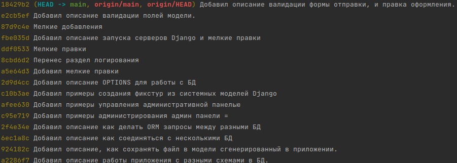
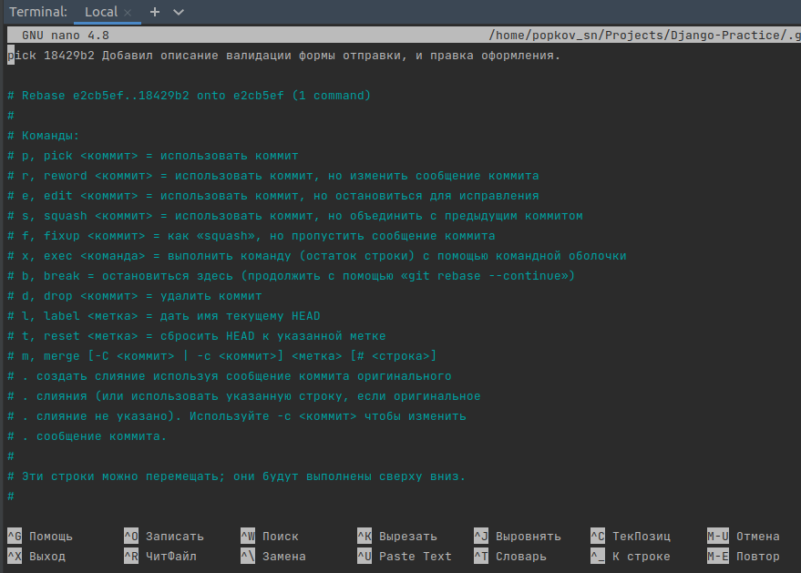
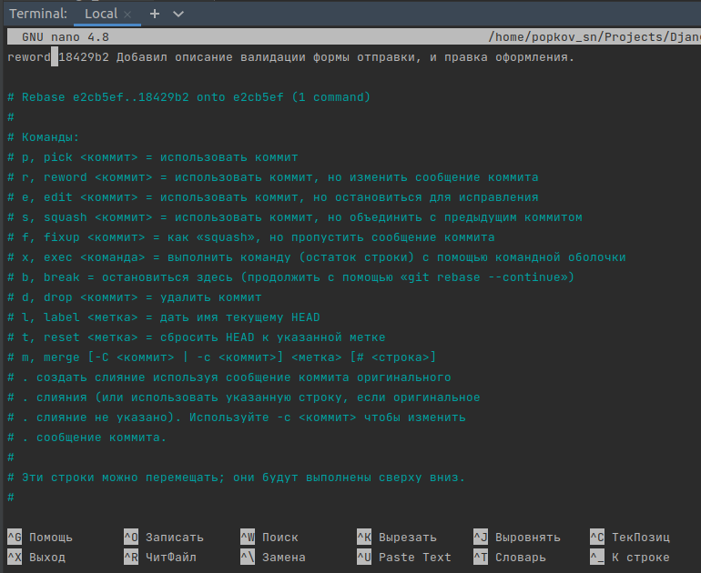
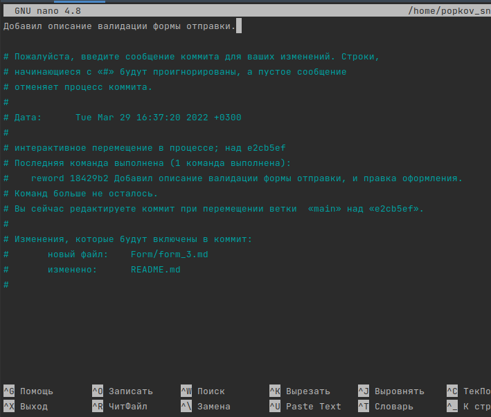
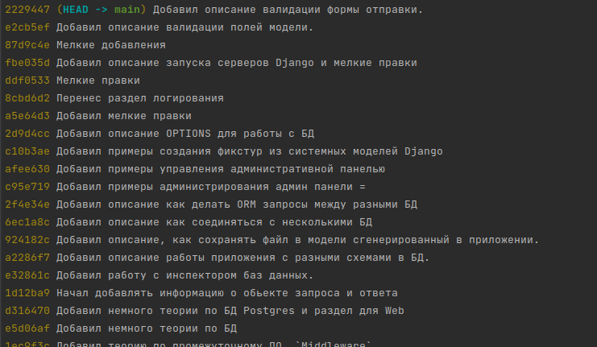

GIT 
---
---

`VCS` (Version Control System) - система контроля версий, это программа, что
позволяет фиксировать программу в ее разных версиях, что появляются в 
процессе разработки.

---

В `git` существует 2 метода внедрения изменений из одной ветки в другую,
это `git merge` и `git rebase` слияние и перебазирование.


[//]: # (---)
[//]: # (`git merge`)
[//]: # (---)
[//]: # (Слияние одной ветки с другой)

---
Настройка `git config`
---
Когда мы отправляем коммиты в репозиторий, они отправляются от лица 
пользователя у которого есть `email` и `name`.

Логин и имя находятся в настрйоках к проекту, в виде уровней вложенности, 
`global`, `local`.

Посмотреть действующие настройки можно крмандами:

```
git config --local user.email
git config --local user.name

git config --global user.email
git config --global user.name
```

Можно переопределить эти параметры след.образом 

```
git config --local user.email "userName"
git config --local user.name "email@yandex.ru"
```

Когда вы комитите в репизиторий, не все коммиты будут учтены при 
создании статистики коммитов, в настройках репозитория указаны подключенные
`email`, они есть 2 типов, `email` могут быть с пометкой `Primary` и 
второстепенные, при создании статистики коммитов учитываются только те
коммиты, которые сделаны от `Primary`.

---
`git rebase`
---
И так, есть ветка `dev` и ветка `feature`,
если ветка `feature` она создана от ветки `dev` и на протяжении всей 
работы с веткой `feature` в ветки `dev` не было никаких изменений, то в такой
случае, мы можем без приветственно влить `feature` в ветку `dev` как
с помощью метода `merge` так и `rebase` и никаких проблем и конфликтов не 
будет.

Но в случае если в процессе работы с `feature` в ветку `dev` тоже были
внесены изменения, то в таком случае, при слиянии могут возникнуть конфликты,
но даже при решении этих конфликтов, при слиянии ветки `dev` с веткой 
`feature` по истории коммитов будет видно, что было ветвление.

И наконец метод `rebase`, когда мы находимся в ветке `feature` и в тот же 
момент в ветке `dev` происходили коммиты, когда находясь в ветке `feature`
мы можем сделать `git rebase dev` после этого, все коммиты что были сделаны
в ветке `dev` с момента когда мы создали ветку `feature`, все эти коммиты 
будут перемещены из ветки `dev` в ветку `feature`, и будут вставлены в 
самое начало ветки `feature`, и уже после них, на эти коммиты вставленные 
из ветки `dev` поверх, будут вставлены те коммиты которые были в ветке
`feature` до того как мы ввели команду `git rebase dev`, то есть будут
создано впечатление как будто мы ответвились от ветки `dev` только что,
и никто никаких коммитов в ветке `dev` попросту не успел сделать с момента
нашего ветвления.

А после этого мы можем с помощью `git merge` просто влить ветку `feature`
в ветку `dev` и никаких конфликтов не будет, однако конфликты могут
возникнуть на момент перебазирования `git rebase dev` внутри ветки
`feature`, конфликты в любом случае придется решать, но их решение будет 
происходить внутри ветки `feature` до слияния с веткой `dev`.

Если в процессе `git rebase dev` возникают конфликты, то их преедется решать,
в момент возникновения конфликта мы можем отменить перебазирование с 
помощью команды:

    git rebase --abort

Или, решив конфликт, мы можем продолжить перебазирование с помощью команды:

    git rebase --continue 

И завершить перебазирование.

---
Конфликты
---
Конфликты возникают, когда при слиянии разных версий программного кода 
один и тот же участок кода имеет 2 разных версии, и `git` просто не 
знает какой именно участок кода оставить при слиянии.

При возникновении конфликтов, в файле с конфликтом, выводится специальное
описание, которое показывает 2 версии программного кода, из 2 разных версий,
таким образом мы можем увидеть подробное описание обеих версий, и решить 
какую из них оставить.

    <<<<<<< HEAD
    this is some content to mess with
    content to append
    =======
    totally different content to merge later
    >>>>>>> new_branch_to_merge_later

`=======` - это центр конфликта, все содержимое между этим центром и 
строкой `<<<<<<< HEAD` является содержимым версии кода из главной ветки,
в которую мы вливаем изменения, а содержимое между центром и строкой
`>>>>>>> new_branch_to_merge_later` это версия вливаемой ветки.

Выбрав и оставив одну из версий программного кода, должны пометить его
как файл с решенным конфликтом, для этого просто достаточно пометить его
через `git add file.py`

---
Тэги в `Git`
---
Тег в гите - это уникальная метка, которая может быть прикреплена
к определенному коммиту, и тем самым сохраняет этот коммит как
уникальное состояние программы.

---
Создание тега
---
Создаем обычный коммит, как всегда

    git add .
    git commit -m "..."

Указатель `HEAD` автоматически сдвинется и будет указывать на этот
коммит после этого создаем тег

    git tag v1.5.12

Этот тег автоматически захватывает тот коммит на который указывает
указатель `HEAD` и прикрепляется к хэшу этого коммита

Далее отправляем наш коммит в репозиторий

    git push

При этом отправлен будет только сам коммит, теги по дефолту
не отправляются для отправки именно тегов есть своя команда

    git push origin v1.5.12

Только после этого теги будут отправлены в репозиторий, где
origin означает родной репозиторий и родную ветку для
того коммита к хэшу которого прикреплен тег

Зачем нужны теги ? Помимо дефолтных вещей типа уникальных
фиксаций коммитов в истории разработки, теги также используют
для пайплайнов, для запуска сборки докер контейнеров, настраивают
тригеры на коммит именно с тегом, и в момент появления тега начинается
сборка проекта.

---
Gitflow
---

[Почитать про Gitflow](https://proglib.io/p/git-github-gitflow/)

Gitflow - это система того как управлять и организовать работу 
веток в среде git, суть схемы веток таков:

1. Создается репозиторий
2. Репозиторий инициализируется
3. Начинается работа на ветке develop
4. Возникает необходимость опробовать новую штуку – создается 
   feature-ветка и делаются коммиты
5. Закончив работу на feature-ветке, вы сливаете ее с develop
6. Если вы довольны текущей версией, но хотите продолжить работу,
   создается ветка release, куда перемещается текущая версия. 
   Правка багов будет происходить на этой же ветке.
7. Когда с веткой release покончено, время слить ее в master 
   и продолжить работу с develop
8. Кроме того, этот момент можно отметить на master-ветке

---
Изменить комментарий к коммиту
---
Допустим мы сделали коммит, но решили исправить его комментарий, с начала
посмотрим на все сделанные коммиты

```
git log --oneline
```



Скажем мы захотели изменить комментарий к последнему коммиту, сделать это мы
можем такой командой с указанием номера коммита с последнего в обратном порядке

```
git rebase -i HEAD~1
```

Это откроет редактор с коммитом, замените `pick` на `reword`.





Это автоматически откроет редактор с комментарием, отредактируйте его и 
сохраните файл.



Далее посмотрев логи можно увидеть что комментарий изменился



Все эти изменения приведут к изменению комментария коммита, но измениться только 
история коммитов локально, следует запушить изменения в репозиторий чтобы 
история была одинаковой.

```
git push --force
```

---
Переименование ветки
---
Если по какой-то причине мы назвали ветку неверно, и хотим ее переименовать как 
локально так и удаленно, с удалением старой ветки:
   
```
# переименовали ветку локально
git branch -m старое_название новое_название

# переименование и удаление удаленного репозитория
git push origin :старое_название новое_название
```

Указание символа двоеточия перед старой веткой, указывает именно удалить ее
`:старое_название`

В итоге получим сообщение типа
```
- [deleted]         release/task-12
* [new branch]      features/task-12 -> features/task-12
 ```
