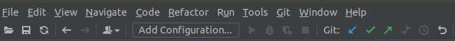
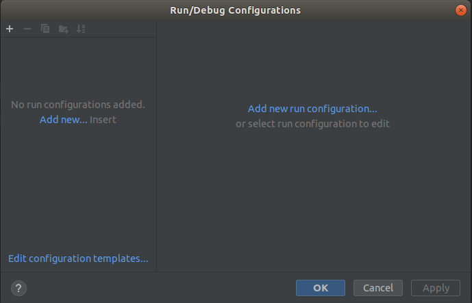
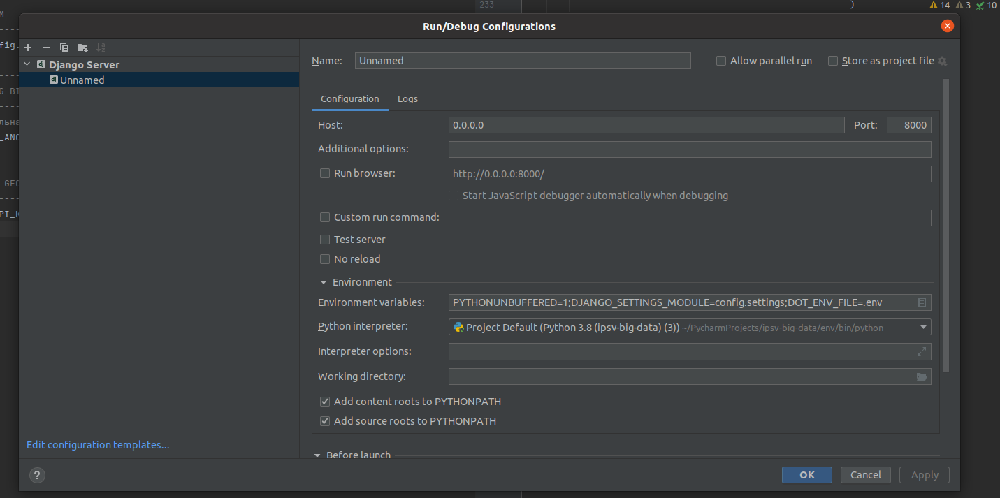
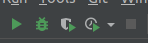

Настройка сервера `PyCharm` для дебага
---
---

Для настойки дебага в `PyCharm` есть специальная панель

Нажимаем на добавить конфигурацию `Add Configuration`

Нажимаем на `Add new` и нам открывается окно с выбором настройки, тут
есть как настрока для обычного `python` скрипта, тк и настрйока `Django`,
выбираем `Django` и нам открывается окно настройки:

Добавляем следующие настрйоки:

1) `Name` - название для нашей конфигурации, можно выбирать любое

2) `HOST` - это хост, адрес по которому наш `Django` сервер будет доступен
 в браузере, используется домашний адрес машины `127.0.0.1` или `0.0.0.0`.
 В поле `Run browser` будет отображаться полный `URL` адрес по которому
 сайт будет доступен в браузере, со стандартным портом `8000`

3) `Environment interpreter` - тут мы можем указать переменные окружения с
 которыми будет запущен сервер для дебага, переменные окружения это настройки
 с которыми можно запускать процесс.

4) `Python interpreter` - путь к интерпретатору питона, сервер для дебага 
 будет запущен с этим интерпритатором, если для нашего проекта мы используем
 виртуальное окружение, то указываем путь к интерпритатору питона этого 
 виртуального окружения, `{путь до проекта}/env/bin/python`. Если используем
 глобальный интерпритатор питона, то указываем путь до глобального 
 интерпритатора питона.

После этого сервер для бебага будет доступен на панели с инструментами

